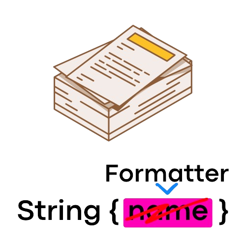

# 🛠️ Formatter 🚀

<p align="center">
	
</p>

<p align="center">
	<a href="https://opensource.org/licenses/MIT">
		</a>
    <a href="https://github.com/seba4316/Java-Formatter" alt="Last Commit">
        </a>
</p>

String Formatter is a lightweight and versatile Java library designed to simplify text manipulation tasks by providing powerful tools for managing placeholders in strings.

## 🌟 Features

✨ **Easy Placeholder Management**: Effortlessly handle placeholders in your strings with intuitive methods.
🔧 **Dynamic Formatting**: Replace placeholders dynamically with values of your choice.
💡 **Simple Integration**: Seamless integration into your Java projects for quick and efficient development.

## 🚀 Getting Started

### 📋 Prerequisites

Ensure you have Java JDK 8 or later installed on your machine.

### 🔧 Setup

To use String Formatter in your Java project, simply include it as a dependency in your build configuration.

```xml
<dependency>
    <groupId>dev.utano</groupId>
    <artifactId>Formatter</artifactId>
    <version>1.1</version>
</dependency>
```

## Quick Start

### Using Key-Value Placeholders

```java
String formattedText = Formatter.format("Hello, {name}!", new PlaceHolder("name", "John"));
System.out.println(formattedText); // Output: Hello, John!
```

### Quick Placeholders

If you're working with static text, consider using quick placeholders for better performance.

By default, quick placeholders are represented by the percentage sign (%).

```java
String formattedText = Formatter.format("Hello, %!", "John");
System.out.println(formattedText); // Output: Hello, John!
```

### Formatter configuration

Create an instance of Formatter and FormatterSettings to change the formatter’s behavioiur.

```java
new Formatter(new FormatterSettings() {
    @Override
    public String getStartCharacterString() {
        return "/"; // Default: `{`
    }

    @Override
    public String getEndCharacterString() {
        return "\"; // Default: `}`
    }

    @Override
    public String getQuickCharacterString() {
        return "??"; // Default: "%"
    }

    @Override
    public boolean isCaseSensitive() {
        return false; // Default: true
    }
    
    @Override
    public boolean isApplyFormatterToPlaceHolders() {
		return true; // Default: false
	}
});
```

> [!TIP]
>
> Override methods selectively, focusing only on those that require customization.

You can override the methods to change the characters used for both quick placeholders and key-value placeholders, besides disabling case sensitivity or apply formatting to placeholders.

#### Apply Formatter to Placeholders

Enabling this allows you to share one set of placeholders and apply it themselves. Here is a quick demonstration from a test:

```java
Formatter formatter = new Formatter(formatterSettings);
String format = "{sender}> {message}";
String sender = "User";
String message = "Hello, {api_key}";
PlaceHolder[] placeHolders = new PlaceHolder[]{
        new PlaceHolder("sender", sender),
        new PlaceHolder("message", message),
        new PlaceHolder("api_key", "MY_SUPER_SECRET_API_KEY")
};
```

If `#isApplyFormatterToPlaceHolders()` returns false the output will look like this: `User> Hello, {api_key}`. However, if the method returns true, the output will be: `User> Hello, MY_SUPER_SECRET_API_KEY`

> [!WARNING]
>
> Enabling this setting makes your code vulnerable to injection attacks. It's recommended to avoid enabling it when user input is involved or to sanitize the input beforehand

### 🤝 Contributing

We welcome contributions to make the Formatter even better! Feel free to fork the repository, make your changes, and submit a pull request.

### 📄 License
This project is licensed under the MIT License - see the LICENSE file for details.

Happy Coding! 🎉
